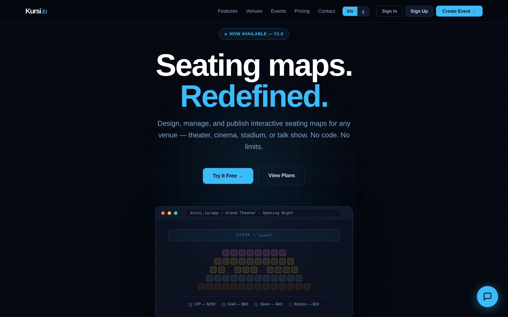
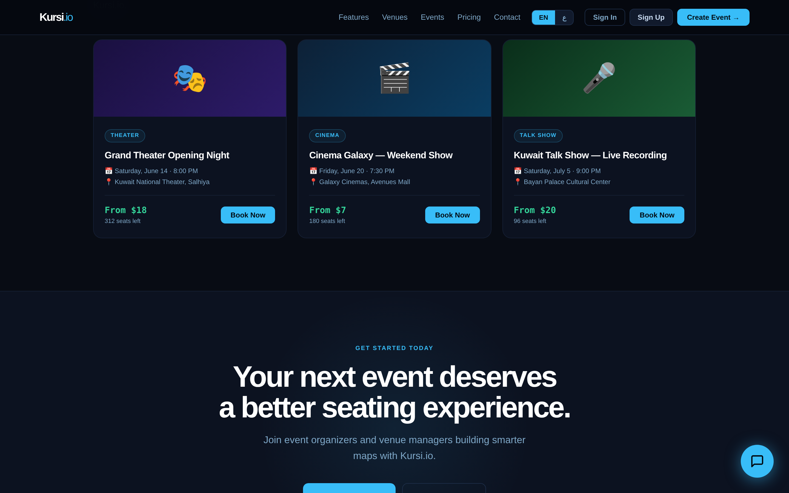
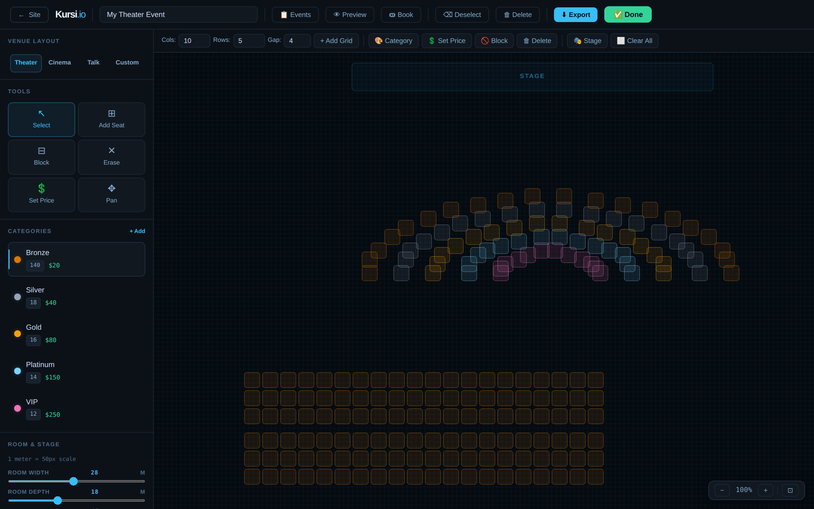
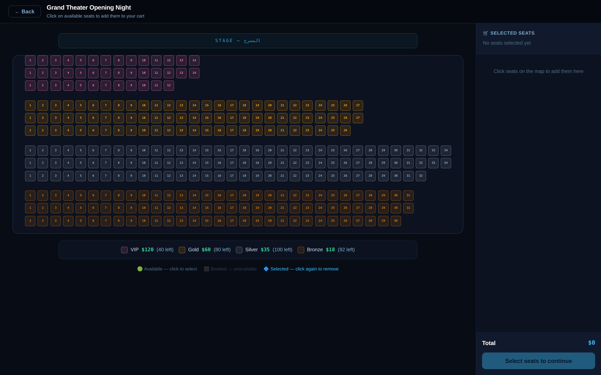
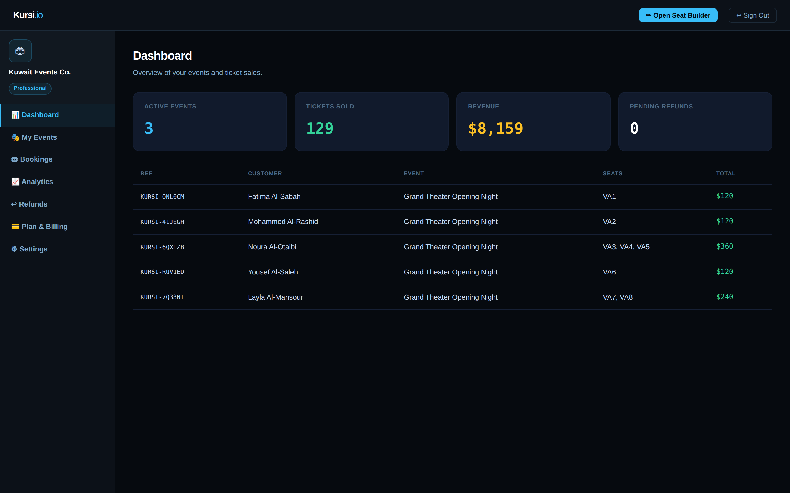

# Kursi.io — Frontend

> **Seating maps. Redefined.** A bilingual event ticketing platform built for theaters, cinemas, stadiums, and talk shows in Kuwait.

[](https://alkhatemtv.github.io/kursi-frontend/)
[](https://github.com/alkhatemtv/kursi-backend)
[](#license)

🌐 **Live demo:** [alkhatemtv.github.io/kursi-frontend](https://alkhatemtv.github.io/kursi-frontend/)

---

## Screenshots

### Homepage
A bilingual landing page (English / Arabic) with a live preview of the seat editor and stylized event listings.



### Real event photos
Six event categories — Theater, Cinema, Talk Show, Stadium, Opera, and Conference Hall — each with a real photograph and live availability counter.



### Drag-and-drop seat builder
Organizers design their venue layout seat-by-seat with categories (VIP / Gold / Silver / Bronze), per-seat pricing, and templates for theater, cinema, or talk-show layouts.



### Customer booking flow
Customers click directly on available seats. Maximum 3 seats per booking (anti-scalping). Booked seats are visually disabled. Real-time pricing in the cart panel.



### Organizer dashboard
Live KPIs, recent bookings, seat-status visualization, and per-event analytics with revenue breakdown by category.



---

## What is this?

Kursi.io is a **full-stack event ticketing platform** designed for the Kuwaiti market. The concept addresses a real local need: many small theaters, cinemas, and talk-show venues in Kuwait still rely on manual seat booking, paper tickets, or fragmented social-media communication. Kursi.io provides organizers with a graphical seat-mapping tool to design venue layouts, lets them publish events, and gives customers a clean interface to browse those events and book seats.

**The name** comes from the Arabic word كرسي (kursi), meaning "seat."

---

## Tech stack

### Frontend (this repo)
- **HTML5 + CSS3 + vanilla JavaScript** in a single `index.html` file
- **Bilingual** English / Arabic with full RTL support
- **Dark and light themes** with localStorage persistence
- **Inline SVG illustrations** + real Unsplash photos for event imagery
- **Auth0 Single Page Application SDK** for Google sign-in
- **Custom QR code generator** (Reed-Solomon, no external library)
- **Hosted on GitHub Pages** (free, HTTPS, auto-deploy from `main`)

### Backend ([separate repo](https://github.com/alkhatemtv/kursi-backend))
- **FastAPI** (Python 3.12) with SQLAlchemy 2.0 and Pydantic 2
- **SQLite** (development) — designed for drop-in PostgreSQL upgrade
- **Auth0 JWT verification** with JWKS rotation
- **22 REST endpoints** covering users, events, bookings, refunds
- **Hosted on Render** (free tier, auto-deploy from GitHub)
- **Auto-generated Swagger UI** at [/docs](https://kursi-backend.onrender.com/docs)

### Authentication
- **Auth0** managed identity (free tier)
- **Google OAuth2** social login
- **Email + password** with custom UI
- **JWT tokens** (RS256) with custom role claims

---

## Features

### For customers
- Browse events with photos, prices, and seat availability
- Bilingual interface (English / Arabic, full RTL)
- Click-to-select seat booking with live cart pricing
- **3-seat maximum per booking** (anti-scalping rule)
- Fake-payment checkout (no real money in demo mode)
- QR code ticket with booking reference
- "My Tickets" dashboard with refund requests
- **24-hour refund rule** — refunds blocked within 24h of event start
- Light / dark mode toggle (persisted)
- AI chatbot for FAQ support

### For organizers
- Drag-and-drop seat builder with venue templates
- Per-category pricing (VIP / Gold / Silver / Bronze)
- Live event status (active / inactive / scheduled)
- Real-time bookings dashboard with KPIs
- Refund approval workflow
- Analytics: revenue by event, category breakdown, occupancy %
- Seat map view with live booked / blocked / available status
- Multi-event management
- Bilingual organizer flow

### Bonus
- Live Google Maps integration (Al-Hamra Tower office)
- In-page chatbot with quick replies
- Lighthouse-tested accessibility
- Mobile-responsive layout

---

## Architecture

```
┌─────────────────────────┐         ┌──────────────────────┐
│  Browser (your users)   │ ◄─────► │   GitHub Pages       │
│  HTML / CSS / JS        │         │   index.html         │
└─────────┬───────────────┘         └──────────────────────┘
          │
          │ Bearer JWT (Auth0)
          ▼
┌─────────────────────────┐         ┌──────────────────────┐
│   Auth0 (login)         │         │   Render             │
│   issues JWT tokens     │ ◄─────► │   FastAPI + SQLite   │
└─────────────────────────┘  verify │   kursi-backend      │
                             JWKS   └──────────────────────┘
```

The browser fetches the static frontend from GitHub Pages, the user logs in via Auth0, then the frontend calls the FastAPI backend on Render with a JWT for every authenticated request.

---

## Local development

This is a **single-file static website**. No build step. No npm install.

```bash
# Clone
git clone https://github.com/alkhatemtv/kursi-frontend.git
cd kursi-frontend

# Open the file directly in your browser
# Windows:
start index.html
# Mac:
open index.html
# Linux:
xdg-open index.html
```

That's it. Edit `index.html`, refresh the browser. There's no compilation, no bundler, no transpilation.

To wire up your own Auth0 + backend instance, edit the constants at the bottom of `index.html`:

```javascript
const AUTH0_DOMAIN    = "your-tenant.auth0.com";
const AUTH0_CLIENT_ID = "your-client-id";
const AUTH0_AUDIENCE  = "https://api.kursi.io";
const API_BASE        = "https://your-backend.onrender.com";
```

---

## Project structure

```
kursi-frontend/
├── index.html              # The entire app (frontend, ~5000 lines)
├── HANDOFF.md              # Development notes / phase tracking
├── README.md               # This file
└── docs/
    └── screenshots/        # Screenshots used in this README
```

---

## Roadmap

### ✅ Phase 1 — Shipped
- Light / dark mode with persistence
- Real event photos (Unsplash + AI illustrations as fallback)
- Google sign-in via Auth0
- 3-seat-max booking limit
- 24-hour refund rule
- Real QR code generation on tickets
- Bilingual customer refund flow

### 🛠 Phase 1.5 — Backend wiring (planned)
- Replace `localStorage` calls with real API calls to FastAPI backend
- Multi-user data persistence
- Real-time event updates across browsers

### 🔮 Phase 2 — Advanced editor (planned)
- Canvas-based seat editor (Konva.js or Fabric.js)
- Free-form venue objects (stage anywhere, walls, exits, custom shapes)
- Multi-select, drag-select, snap-to-grid, undo/redo
- Reusable seating maps (one map → multiple events)
- 5+ venue templates (cinema, theater, opera, stadium, conference hall)
- Organizer photo upload per event

---

## Built with AI assistance

This project was developed using **Claude (by Anthropic)** as an AI coding assistant throughout. The architecture, code, debugging, and deployment were all developed via conversation with Claude — first via the web chat interface, then via [Claude Code](https://www.anthropic.com/claude-code) for the multi-file edits in Phase 1. This represents a deliberate methodology choice: **AI-assisted hybrid development**, where a non-programmer works with an LLM to produce, deploy, and operate real production-shape applications. The author is a graduate student in Information Technology, not a software engineer by training.

This approach is documented in the academic report submitted with this project for MSIT 500 at Kuwait University.

---

## Author

**Abdullah Alkhatem**
MSIT 500 — Introduction to Information Technology
Department of Information Science, College of Life Sciences, Kuwait University
Spring 2025/2026

Course instructor: Dr. Fatemah Husain

---

## License

MIT — feel free to fork, learn from, or build on top of this project. If it's useful to you, a star on the repo is appreciated.

The Kursi.io name and brand are reserved by the author. Code is open source.

---

## Acknowledgments

- Real photographs from [Unsplash](https://unsplash.com) (free for commercial use, no attribution required)
- [Auth0](https://auth0.com) for managed identity (free tier)
- [Render](https://render.com) for backend hosting (free tier)
- [GitHub Pages](https://pages.github.com) for frontend hosting (free, HTTPS)
- [Anthropic](https://www.anthropic.com) — Claude AI assistant used throughout development
- [FastAPI](https://fastapi.tiangolo.com) for the modern Python backend framework
